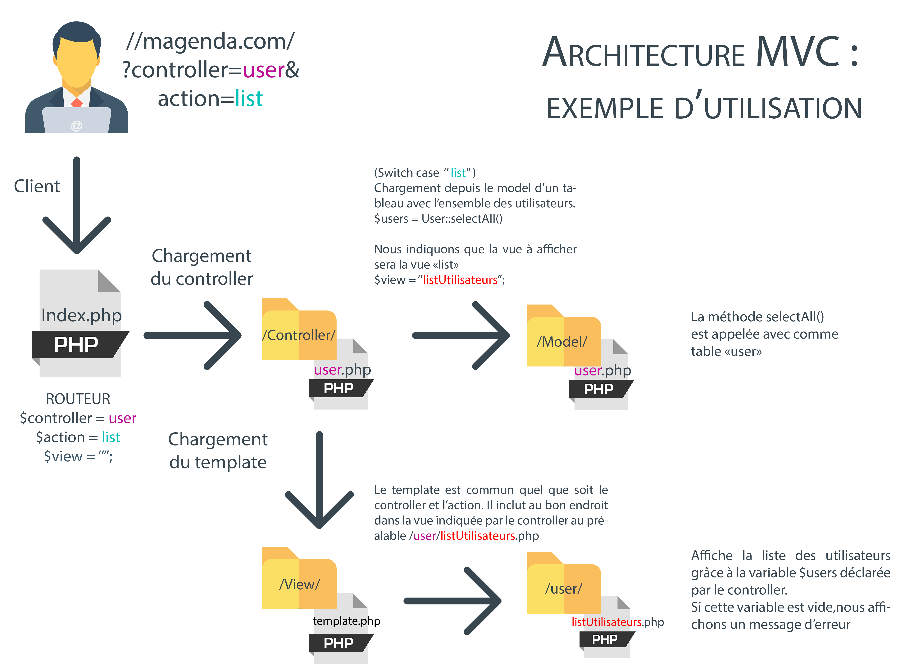

# magenda
Projet E4 : SI-4202B - Dev WEB [PHP-HTML/CSS -- JS]

## Lancer le site
Il vous suffit de lancer le site à l'adresse suivante : 
http://localhost/nomdudossier/ 
pour voir la premiere page du site. 

La suite des pages sera chargé tel que : <br />
<code>http://localhost/nomdudossier/?controller=<u>NomDuController</u>&action=<u>ActionARealiser</u></code>
## Configuration de la base de données

### Le fichier Config.php
Pour bien configurer le projet vous devez créer un fichier `Config.php` dans le dossier `Config`
Vous pouvez directement copier coller le fichier "Config.default.php" et modifier les valeurs. 

Attention, le fichier Config.php doit être VOTRE fichier, et donc ne jamais être "publié" sur git(hub).

```php
<?php
namespace Magenda\Config;
class Config{
    // Informations pour la connexion à la bdd
    const DB_HOSTNAME = "localhost";
    // Identifiant de connexion à la bdd
    // root par defaut sur Wamp
    const DB_USER = "root";
    // Mot de passe pour l'identifiant
    // (souvent rien sur wamp)
    const DB_PASSWORD = "";
    // Nom de votre base de donnée
    const DB_DATABASE = "magenda";

    const DEV = true;
}
?>
```

### Creation de la base de données
Pour créer la base de donnée, il vous suffit d'ouvrir phpMyAdmin 
(wamp : http://localhost/phpmyadmin/)
et de charger le fichier (databse.sql)[database.sql]

## Comment ca marche ? 
Le `routeur` "index.php" permet de charger le bon controller en fonction des paramètres indiquées par le client dans la requête.
Nous retrouvons le controller souhaité dans la variable `$_GET["controller"]`
et l'action à effectuer dans le controller dans la variable `$_GET["action"]`.

Ces valeurs sont respectivement stocké dans les variables `$controller` et `$action`

Nous chargeons ensuite le controller souhaité. 
Pour cela nous incluons le fichier ayant pour nom `$controler`.php.
Le controller doit TOUJOURS, quelque soit l'action, instancier la variable `$view`.

Une fois que le controller est executé, nous pouvons charger le template qui est présent dans 
dans le fichier `View/template.php`, c'est lui qui s'occupera de charger la vue indiqué par le controller. 

### Fonctionnement des controller(s)
Ce fichier se trouve obligatoirement dans le dossier `Controller/`

Le controller contient un switch tel que : 

```php
<?php
switch($action){
    case "actionPossible1":
        //Appel du model
        //Generation de conde...
        // Calcul complexes...
        // TOUT est possible ici
        // IMPORTANT 
        $view = "la vue à charger";
    break;
    case "actionPossible2":
        
    break;
}
?>
```

L'objectif est ici de pouvoir faire plusieurs controller, et donc de séparer au mieux notre code. 

### Le template
Le template permet de pouvoir modifier le design du site facilement, sans devoir parcourir l'ensemble des vues du site. 
Il ressemble par exemple à : 
```php
<!DOCTYPE html>
<html lang="en">
<head>
    <meta charset="UTF-8">
    <title>Titre</title>
</head>
<body>
<header></header>
<nav></nav>
<?php
    // Nous incluons la vue
    require_once __DIR__ ."/".$controller."/".$view.".php";
?>
<footer></footer>
</body>
</html>
```
Comme nous pouvons le voir, il s'occupe lui même de charger la vue au bonne endroit. 
La vue est indiqué au préalable par le controller dans la variable $view. 
Elle se trouve dans le fichier `/View/$controller/$view.php`

Où $controller correspondant au nom du controller, et où $view est la valeur indiqué par le controller au préalable. 
## Récapitulatif par l'image

    
